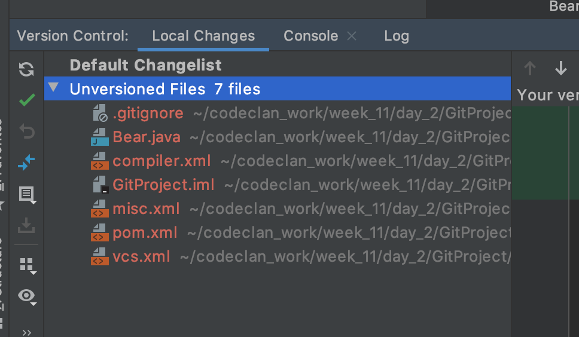
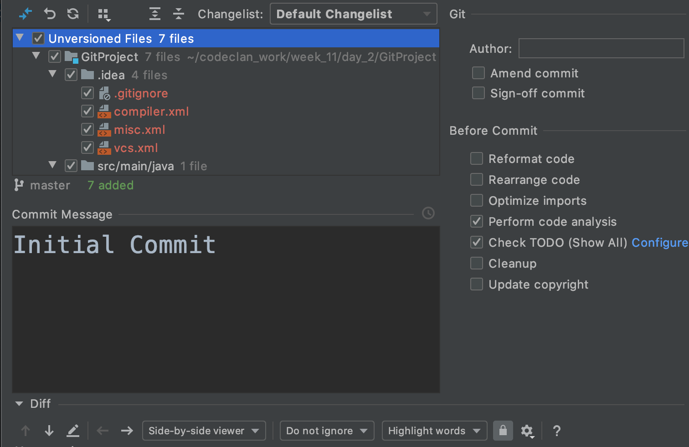

# IntelliJ and Git

## Learning Objectives
 - Add Git Credentials to IntelliJ
 - Add a .gitignore file
 - Use Git from within IntelliJ IDE
 - Push to remote repository from IntelliJ

## IntelliJ and Git

IntelliJ comes with a handy Git integration tool so we can do all of the things that we do in the command line from within terminal. Like `git add .`, `git commit -m "Message"`, `git push`, etc.

## Adding Git credentials to IntelliJ

 - Open `Preferences` - ( `cmd + ,` )

 - Go to Version Control and select `GitHub`

 - Check the box `Clone git repositories using ssh`

 - Click on the + symbol.

 - Enter your login email and password for GitHub.

 - Click Login

 - Click `Apply`

 - Click `OK`

## Creating a `.gitignore` file

We will need to `gitignore` a lot of files that are user and Java specific.

To do this we need to install a plug in

 - Go to `Preferences`
 - Select `Plugins`
 - Select `marketplace`
 - Search for `.ignore`

The name of the plugin is `.ignore` and should be the first on the list.

 - Install `.ignore` and restart IntelliJ

## Creating a template `.gitignore`.

With preferences still open:

 - Select `Version Control` > `Ignore Files Support`

 - Under User Temlplates click the + symbol

 - Call the template `Codeclan Java`

 Paste the following into the right hand pane:

```
# Created by .ignore support plugin (hsz.mobi)
### Java template
# Compiled class file
*.class


# Package Files #
*.jar
*.war
*.nar
*.ear
*.zip
*.tar.gz
*.rar

# IntelliJ
.idea/
out/
target/
.idea_modules/

```

- Click Apply then OK.


Now when you create a Java project in intelliJ you can choose this template to use for all future `gitignore` files.

### Adding `.gitignore` file

To do this right click on project name

- Select new > .ignore file > `.gitignore`


- Select our Codeclan Java template

- Click Generate (Don't worry we will fill this file in shortly)

- Paste the following into the editor -


## How to set up Git Repository in IntelliJ

The first time we do this we need to change a setting that would maybe give us an error later.

 - Open `Preferences`
 - Select `Version Control`
 - Select `Git`
 - Uncheck `Warn if CRLF line separators are about to be commited`

Now we can set up local git repository

 - Open the VCS (Version Control System) menu and select `Enable Version Control Integration..`

 


 - Select `git` from dropdown menu and select `OK`

 > This runs the `git init` command on the project.

 - At the bottom left select the small box in the corner and click `version control`

 


From here we can see the status of our files.

 


## Adding and committing files

When you are ready to add and commit files.

 - Click on the `commit` button 

 - Tick the box for files you want to add and commit (or just tick `Unversioned Files` to select all)

 - Enter in a commit message

 - Click Commit

(You will get a message here. As long as there are no errors click `Commit` - Don't worry about warnings)

 


 - You should get green confirmation.

 


## Adding remote repository

 - Create the repository on GitHub.

 - Go to VCS menu > git > push

 


 - Click on `Define remote`

 


 - Enter in the URL from the browser (Note that this is the HTTPS _not_ the ssh link.)

 


 - Click OK.

 - Click `Push`
