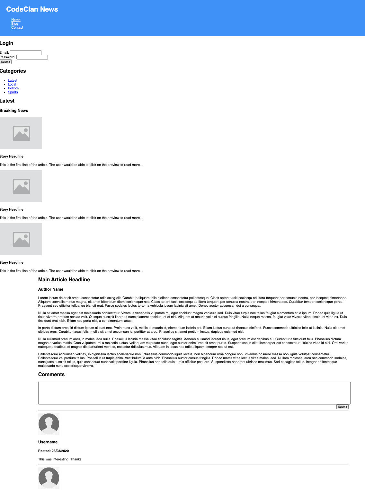

# HTML & CSS Lab & Homework

### Learning Objectives

- Be able to translate a complex web design into a semantic HTML structure
- Be able to apply aesthetic CSS rules to a web page
- Be able to create an HTML form

## Brief

In this lab you will create the HTML structure and basic aesthetic styling for the following web page. Remember, the layout isn't important. We'll learn how to control the positioning of elements on the page using CSS later. Focus on the semantics and structure of the HTML and aesthetic CSS properties such as `color` and `background-color`.

## Getting Started

It is highly recommended that you start by breaking the design down into boxes. You can then start to decide which order to create each box in the HTML and consider how its contents should be structured.

## Research

This design will require you to research `<form>` and `<input>` elements! Note, there are different types of `<input>` elements. You will need to research them and decide which ones will be best for the job.

The forms should be purely aesthetic. They don't need to do anything, other than allow the user to type into them. We certainly aren't asking you to allow a user to log in or be able to post a new comment!

## Resources

- HTML5 Cheat Sheet: https://www.wpkube.com/html5-cheat-sheet/
- MDN - Using HTML Sections & Outlines: https://developer.mozilla.org/en-US/docs/Web/Guide/HTML/Using_HTML_sections_and_outlines