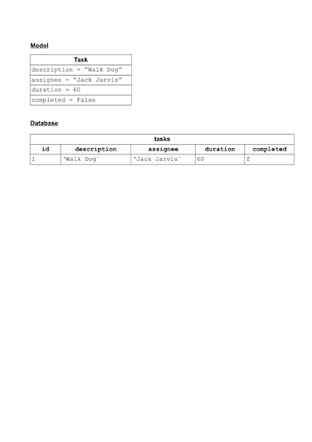

# Connecting to a Database

## Objectives

* Understand how Python talks to a database
* Know that an object maps to a row in the db table
* By the end of this lesson you should be able to create your own single model CRUD app (Python and SQL)

## Task Manager software

We are going to introduce this idea of persistence by creating software that tracks tasks. The end code has been provided so you can reference it as you read through this lesson. To run it, cd into the `code` directory and do the following:

```bash
# Terminal
createdb task_manager
psql -d task_manager -f db/task_manager.sql 
```
This will create the table and populate it with 2 rows.

Then you can run the `console.py` file.

```bash
python3 console.py
```

Ultimately we want to be able to:

* Create new tasks
* Read/Find existing tasks
* Update existing tasks
* Delete existing tasks

Up until now most of this functionality would have been pretty hard to accomplish as we only had the computer's memory to use.

First of all though, we will setup our model and object - just like we have done many times before.

### Task Model

We have a `model` (another name for a class) and it's role will be to speak to the database. A Task has:

-  a description
-  the name of the person assigned to it
-  a duration
-  whether or not it has been completed (this will be False by default)

The Task class is located in the `models` directory

```python

class Task:
    
    def __init__(self, description, assignee, duration, completed = False):
        self.description = description
        self.assignee = assignee
        self.duration = duration
        self.completed = completed
        
    def mark_complete(self):
        self.completed = True
```

## Adding a database

Great, now we want to add a database layer to our application. Each row in the database table will correspond to an instance of the Task class. 

### Mapping an instance to a table row



We want to be able to select all the rows from our tasks table.

We will:

* Import a library, `psycopg2`, which allows us to: 
  - Make a connection to a database 
  - Execute a prepared SQL statement on that database
* Create a function, let's call it 'select_all', but it could be called anything e.g. get_all etc.
* Write our SQL in our method and execute it


We want to differentiate between all our tasks, so what else might we add? An ID

```sql
-- db/task_manager.sql

DROP TABLE IF EXISTS tasks;

CREATE TABLE tasks (
  id SERIAL PRIMARY KEY,
  description VARCHAR(255),
  assignee VARCHAR(255),
  duration INT,
  completed BOOLEAN
);
```

### The psycopg2 library

We now want to be able to get our Python code to communicate with our database. We are going to use a library to help us with this. This library will handle connecting to the database and will execute SQL for us.

We are using a PostgreSQL database so we need to use a library which has been written with this in mind. There are several libraries we could use but we are going to a library called [psycopg2](https://pypi.org/project/psycopg2/), which is the most popular. 

You should already have psycopg2 installed but if not:

The psycopg2 library is not installed automatically when we install python so we need to install it. Can you remember which program we use to install Python libraries and packages? `pip3`.

So let's install psycopg2

```bash
# terminal

pip3 install psycopg2
```

So now we can use this library in our code to connect with our database and run SQL commands. Where shall we write this code? We could add methods to our `Task` class and run them there. That would be fine. But what if we wanted to change the database we were using, maybe one which does not use SQL. We would have to go in and change all the code in our `Task` class. More importantly, the responsibility of our `Task` class is to model a task, not to save tasks to the database. 

What we are going to do is add a layer of code, called a `repository` between our model and our database. This layer will be responsible for taking interacting with the database. This is what's known as a **design pattern** which is common pattern for designing software. We are using the **repository pattern**


As we have a different class for each model, we usually create a different repository for each model. In the **repositories** directory you'll see a file called **task_repository.py**

In this repository file we write the functions for the interactions with the database. These functions are all going to fall into the same pattern:

1) Make a connection to a database

2) Execute a [prepared SQL statement](https://en.wikipedia.org/wiki/Prepared_statement) on that database

3) Close the connection to the database

4) Return the results (if needed)

So it looks like there may be a bit of repeated code in our functions, especially regarding steps 1 and 3. Rather than having the same code repeated in the functions in our repository, we can move this common code out into a helper function into which we simply pass in the SQL we want to run and it will return the results. We can even use this helper function if we add further models and corresponding repositories.

### Creating a SQL Runner

We have a module to run our SQL, called `run_sql`. Since the code is in this file is purely for database interaction, we  place it in our `db` directory:

Have a look at `run_sql.py`. First of all we need to import psycopg2 into our repository

```python
# db/run_sql.py

import psycopg2

```

The psycopg2 library has some helper functions which are not automatically imported when you import psycopg2. These helper functions are in a module called [psycopg2.extras](https://www.psycopg.org/docs/extras.html). We will be using some functionality from this module so we need to import it to. It is common to give this the alias `ext`

```python
# db/run_sql.py

import psycopg2  
import psycopg2.extras as ext

```

Our file is only going to contain one function so we don't really need to create a class. It is going to be just a function which we can call. Therefore, it makes sense to make `run_sql` a module.

Like the name of the file, we've called the function `run_sql`. It takes two arguments, one for the SQL we want to run, and another for the values we want to run that SQL with. Sometimes we might not want to pass in any values e.g. if we are getting all the rows in a table, so we'll give `values` a default value.

```python
# db/run_sql.py

import psycopg2  
import psycopg2.extras as ext

def run_sql(sql, values = None):

```

#### Creating our database connection

To connect to our database we use a function from the psycopg2 library called `connect`. This takes a string as a parameter. This string contains information about the database we want to connect to and is known as a _connection string_. This string usually contains the following information:

- the location of the machine which is hosting the database
- the name of the database
- the login details for the database (username and password)

In our case, the database is on our local machines and we don't need a username and password to log in so in this case we only need to give the name of the database we are connecting to. 

```python
# db/run_sql.py

import psycopg2  
import psycopg2.extras as ext

def run_sql(sql, values = None):

    conn=psycopg2.connect("dbname='task_manager'")

```

Connecting to a database can raise an exception e.g. if the database is on a different machine, that machine may be down, or the login details may be wrong. In that case, we've placed the code where we interact with the database within a `try` block. If an exception is raised then we want to 'catch' a specific type of exception, that is a `psycopg2.DatabaseError`. This is where something has gone wrong when interacting with the database. In this case we will print the error.

We will also add a `finally` block. The code inside this block will run regardless of whether or not the code we `try` to run executes as expected. In this block we want to close our connection to the database as we don't want to leave a database connection open. It might be that our code connects to the database OK but an exception is raised when running our SQL. 

In that case we want to close the connection. Most databases can only handle a set amount of connections at a time so if we stay connected to the database  longer than we need to then we may be preventing another application from connecting to it.

```python
# db/run_sql.py

import psycopg2  
import psycopg2.extras as ext

def run_sql(sql, values = None):

    try:
       conn=psycopg2.connect("dbname='task_manager'") 
    except (Exception, psycopg2.DatabaseError) as error:
        print(error):
    finally:
        conn.close()

```

But, what if our connection to the database failed, then we cannot call the `.close` method. What we can do is set `conn` to `None` at the start of the function and only close our connection if it has been successful i.e. it is not `None`:

```python
# db/run_sql.py

import psycopg2  
import psycopg2.extras as ext

def run_sql(sql, values = None):
    conn = None

    try:
       conn=psycopg2.connect("dbname='task_manager'") 
    except (Exception, psycopg2.DatabaseError) as error:
        print(error):
    finally:
        if conn is not None:
            conn.close()

```

The next thing we need to do is to define something called a __cursor__ to work with. A cursor is a control structure which lets us go through the records in a database. We get this cursor by calling the `.cursor` method on our connection.

By default in psycopg2, these use tuples to represent the data from the database, but we can use  `dict` which allow us to use something similar to  Python dictionaries instead. We do this using `DictCursor` from `psycopg2.extras`. We pass an argument called `cursor_factory`, setting it to `DictCursor` when calling the `cursor` method on our connection

```python
# db/run_sql.py

import psycopg2  
import psycopg2.extras as ext

def run_sql(sql, values = None):
    conn = None
    
    try:
        conn=psycopg2.connect("dbname='task_manager'")
        cur = conn.cursor(cursor_factory=ext.DictCursor)   # ADDED

```

Now that we have our cursor set up, we can run the SQL statement passed into the function. To do this we call the `execute` method on our cursor. We give it two arguments, the `sql` and `values` passed into the `run_sql` function when it is called.

```python
# db/run_sql.py

import psycopg2  
import psycopg2.extras as ext

def run_sql(sql, values = None):
    conn = None
    
    try:
        conn=psycopg2.connect("dbname='task_manager'")
        cur = conn.cursor(cursor_factory=ext.DictCursor)    
        cur.execute(sql, values)  # ADDED
```

So we have run our code on our database so you think that's our changes there permanently. But this is not the case. When we run the code on our database using psycopg2 it runs something called a __transaction__ on our database. These changes are not permanent until they have been committed as they can also be rolled back. So to make the changes made by running our SQL permanent, we need to call the `.commit` method on our connection

```python
# db/run_sql.py

import psycopg2  
import psycopg2.extras as ext

def run_sql(sql, values = None):
    conn = None
    
    try:
        conn=psycopg2.connect("dbname='task_manager'")
        cur = conn.cursor(cursor_factory=ext.DictCursor)    
        cur.execute(sql, values)  
        conn.commit()
```

#### Getting the results

When we run our SQL to get the items from the database we want to access the results to see what we can back. To do this we call the `fetchall` method on our `cursor`:

```python
results = cur.fetchall()
```

This gets all the rows returned from running the query. This is normally returned as a list of tuples, but as we are using `DictCursor` we get a list of dictionary-like items back.

We will return this list at the end of the function, but just in case an exception is raised we will set `results` to be an empty list at the start of the function.

```python
# db/run_sql.py

import psycopg2  
import psycopg2.extras as ext

def run_sql(sql, values = None):
    conn = None
    results = []  # ADDED
    
    try:
        conn=psycopg2.connect("dbname='task_manager'")
        cur = conn.cursor(cursor_factory=ext.DictCursor)   
        cur.execute(sql, values)
        conn.commit()
        results = cur.fetchall()  # ADDED
        cur.close()           
    except (Exception, psycopg2.DatabaseError) as error:
        print(error)
    finally:
        if conn is not None:
            conn.close()
    return results # ADDED
```

Finally, we need to close our cursor(`cur`) otherwise it will continue to keep hold of resources on the database until the connection is finally closed. 

```python
# db/run_sql.py

import psycopg2  
import psycopg2.extras as ext

def run_sql(sql, values = None):
    conn = None
    results = []
    
    try:
        conn=psycopg2.connect("dbname='task_manager'")
        cur = conn.cursor(cursor_factory=ext.DictCursor)   
        cur.execute(sql, values)
        conn.commit()
        results = cur.fetchall()
        cur.close()           # ADDED
    except (Exception, psycopg2.DatabaseError) as error:
        print(error)
    finally:
        if conn is not None:
            conn.close()
    return results
```

We can now use this function in our `task_repository`


## Reading from the database

### Getting all the tasks

We want to be able to list all of the tasks on our web app. So we need a 2 step process here:

* Select from our db table
* Map each row to Python objects

We have a function called `select_all` in our `task_repository` to get all the rows in the `tasks` table in the database and return a list of task objects. The SQL will be a `SELECT` clause. Since we are simply getting all the rows in the table, we do not need to pass any values into the `run_sql` function, but we do want to get the rows the function returns

```python
# repositories/task_repository.py

def select_all(): 
    sql = "SELECT * FROM tasks"
    results = run_sql(sql)

```

The `run_sql` function returns a list of dictionary-like objects, but we really want a list of task objects back. To get this we need to loop through the list of results, getting the information for each task from the dictionary like object, and then creating a list of task objects:

```python
# repositories/task_repository.py
from db.run_sql import run_sql

from models.task import Task #  ADDED

def select_all():  
    tasks = []  # ADDED - in case we get `None` back from run_sql

    sql = "SELECT * FROM tasks"
    results = run_sql(sql)

    for row in results:
        task = Task(row['description'], row['assignee'], row['duration'], row['completed'], row['id'] )
        tasks.append(task)
    return tasks

```

```python
# console.py

import pdb 
from models.task import Task
import repositories.task_repository as task_repository  

result = task_repository.select_all()  # ADDED

for task in result:
    print(task.__dict__)

pdb.set_trace()

```

Currently, this will throw an error, as we are passing in more arguments than Task is expecting. We therefore need to do some changes to our Task model to fix this:


#### Adding the id

In the data returned from the database we have the ID in the dictionary. It would be cool to to have that information in our `Task` instances as well.

```python
# models/task.py

class Task:
    
    def __init__(self, description, assignee, duration, completed = False, id = None):  # MODIFIED
        self.description = description
        self.assignee = assignee
        self.duration = duration
        self.completed = completed
        self.id = id   # ADDED
```

Now if you run your `console.py` you will see the 2 Task objects printed out:

```bash
{'description': 'Walk Dog', 'assignee': 'Jack Jarvia', 'duration': 60, 'completed': False, 'id': 1}
{'description': 'Feed Cat', 'assignee': 'Victor McDade', 'duration': 5, 'completed': False, 'id': 2}
```

## Summary

- We've used a Python library called `psycopg2` to allow Python to talk to our database. 
- We created a helper function, `run_sql.py` to handle the database connection. This reduces the amount of code we need to repeat every time we want to connect to the database.
-  We've employed the **repository pattern** to structure our application in a scaleable way.